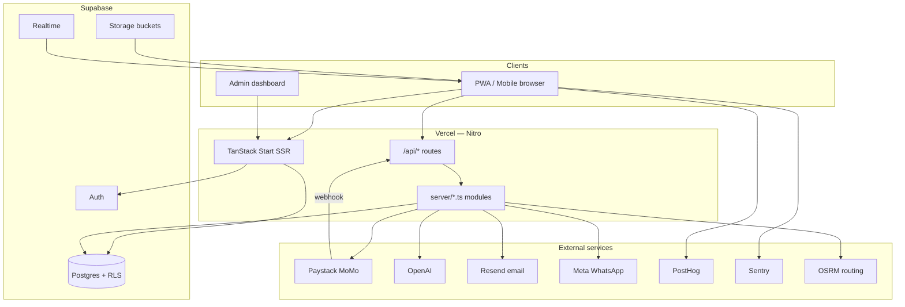
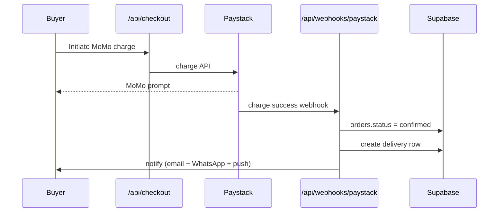
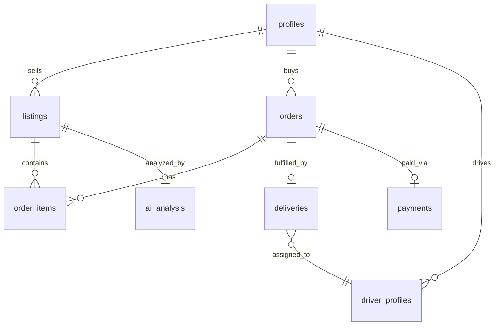

# AgroLink Architecture

Last updated: 2026-07-07

## System overview

AgroLink is a **full-stack SSR web app** (TanStack Start + Nitro) backed by **Supabase** as the single source of truth for data, auth, storage, and realtime. Server-side API routes handle payments, webhooks, AI, and notifications — secrets never reach the browser.



---

## Request layers

| Layer | Location | Responsibility |
|-------|----------|----------------|
| **Routes (UI)** | `src/routes/*.tsx` | Pages, layouts, client hooks |
| **API routes** | `src/routes/api/**/*.ts` | HTTP handlers (checkout, webhooks, search) |
| **Server modules** | `src/server/*.ts` | Business logic (Paystack, comms, AI) |
| **Client API** | `src/lib/api/*.ts` | Supabase queries from browser (RLS-enforced) |
| **Integrations** | `src/integrations/supabase/` | Client + admin Supabase clients |

### Auth flow

1. User signs in via Supabase Auth (`/auth`) — email/password or Google (Lovable OAuth)
2. JWT stored in browser; `AuthProvider` loads profile + roles from `profiles` / `user_roles`
3. `/app/*` routes gated — unauthenticated users redirect to `/auth`
4. **API routes** verify Supabase JWT via `requireAuth()` — identity comes from token, never request body
5. Server routes use `supabaseAdmin` (service role) only where RLS cannot apply (webhooks, search index, cron)

### Data access model

| Client | Key | RLS |
|--------|-----|-----|
| Browser | `VITE_SUPABASE_PUBLISHABLE_KEY` | ✅ enforced |
| Server (user context) | Publishable + user JWT (`api-auth.ts`) | ✅ enforced |
| Server (admin) | `SUPABASE_SERVICE_ROLE_KEY` | Bypasses RLS — server only |

**Not multi-tenant:** one marketplace; admin role is platform-wide. User isolation is per-account via RLS + JWT.

---

## Core domains

### 1. Marketplace (feed + listings)

```
Farmer creates listing → Storage upload → OpenAI moderation → listings.status = active
                                              ↓
Buyer opens feed → feed_rank view → rankListings() → FeedPlayer (vertical scroll)
```

- **DB:** `listings`, `listing_likes`, `listing_comments`, `listing_reports`, `ai_analysis`
- **View:** `feed_rank` — pre-computed score join (listings + profiles + AI)
- **Algorithm:** [FEED_ALGORITHM.md](./FEED_ALGORITHM.md)

### 2. Commerce (cart → checkout → order)



- **DB:** `carts`, `cart_items`, `orders`, `order_items`, `payments`, `deliveries`
- **Pricing:** `computeDeliveryQuote()` — OSRM distance + `delivery_pricing_config` (surge, peak, vehicle)
- **Escrow:** Paystack subaccounts split; release via transfers on delivery complete

### 3. Logistics (driver)

```
Driver registers → upload docs → admin approves → go online
       ↓
Paid order created → push notify drivers → accept (30s countdown) → pickup → deliver + POD photo
       ↓
Buyer realtime tracking ← driver_profiles.lat/lng ← OSRM route polyline
```

- **DB:** `driver_profiles`, `driver_documents`, `deliveries`
- **Maps:** `CorridorMap.tsx` — Leaflet + dark tiles + OSRM
- **Gate:** `VerifiedTransportGate` — only approved drivers see jobs

### 4. Comms (notifications + chat)

Central hub: `src/server/comms.ts` → `notifyUser()`

| Channel | Trigger | Implementation |
|---------|---------|----------------|
| In-app | All events | `notifications` table |
| Email | Order updates | Resend (`email-notify.ts`) |
| WhatsApp | Order updates | Meta Cloud API (`whatsapp.ts`) |
| Web push | Driver jobs, alerts | VAPID + `web-push` |
| FCM | Native (optional) | `FCM_SERVER_KEY` |

Chat: `messages` table + `chat-attachments` bucket + realtime subscription.

### 5. Admin

- **Payments** — GMV from `payments` table
- **Disputes** — buyer/seller dispute workflow
- **Listings** — flagged / rejected queue
- **Surge pricing** — `/app/admin/pricing` → `delivery_pricing_config`

---

## API routes

| Route | Method | Purpose |
|-------|--------|---------|
| `/api/checkout` | POST | Paystack MoMo charge |
| `/api/webhooks/paystack` | POST | Payment confirmation (HMAC verified) |
| `/api/delivery/quote` | POST | OSRM + pricing engine quote |
| `/api/moderate` | POST | OpenAI moderation / price advice / TinyFish ingest |
| `/api/search/global` | GET | ⌘K search (listings, farmers, orders) |
| `/api/comms/notify` | POST | Engagement notifications (like, comment, follow) |
| `/api/chat/send` | POST | Send message + attachment |
| `/api/settings/notifications` | GET/POST | User notification prefs |
| `/api/admin/pricing` | GET/PATCH | Surge config |
| `/api/otp/send` | POST | Checkout OTP email (Resend) |
| `/api/otp/verify` | POST | Verify OTP |
| `/api/push/register` | POST | Register web push token |
| `/api/deliveries/complete` | POST | Mark delivered + trigger payout |
| `/api/deliveries/reassign-expired` | POST | Cron: reassign timed-out jobs |

---

## Database schema (high level)



**Migrations:** `supabase/migrations/` — applied via `npm run db:migrate` (Supavisor pooler, IPv4).

Key RLS principle: **payments table has no client writes** — service role only.

---

## Storage buckets

| Bucket | Public | Purpose |
|--------|--------|---------|
| `listing-images` | ✅ | Produce photos (incl. demo SVGs) |
| `listing-videos` | ✅ | Listing videos |
| `chat-attachments` | ✅ | Chat image/video uploads |
| `delivery-pod` | ✅ | Proof-of-delivery photos |
| `driver-documents` | ❌ | Ghana Card, license uploads |

---

## Frontend architecture

```
__root.tsx
  └── AuthProvider
        └── AppShell (role-aware nav)
              ├── Marketing routes (/, /farmers, /pricing…)
              └── /app/* (authenticated)
                    ├── buyer/feed → FeedPlayer (react-vertical-feed + react-riyils)
                    ├── buyer/cart → Paystack checkout + OTP
                    ├── transport → CorridorMap + job accept
                    └── inbox/chat → ChatThread + attachments
```

**State:** TanStack Query for server state; local role cache in `localStorage` for offline resilience.

**Analytics:** PostHog events in `analytics.ts` — feed, checkout, driver, search, chat, admin.

---

## Build & deploy

| Target | Preset | Output |
|--------|--------|--------|
| Vercel | `vercel` (auto-detect) | `.vercel/output/` |
| Cloudflare | `cloudflare-module` (default local) | `.output/` + wrangler |

Build: `vite build` → client bundle + Nitro server function.

See [DEPLOY_VERCEL.md](./DEPLOY_VERCEL.md) for production env vars and post-deploy config.

---

## Security summary

- RLS on every table — see [SECURITY.md](./SECURITY.md)
- Paystack webhook HMAC verification
- OpenAI moderation before listing goes live
- Service role key server-only (never `VITE_*`)
- Rate limits on listing creation and API bursts

---

## Testing

| Suite | Command | Scope |
|-------|---------|-------|
| Build gate | `npm run build` | Production bundle |
| API smoke | `npm run stress:comms` | Search, settings, chat, admin |
| Key verification | `npm run test:keys` | External API connectivity |
| Full E2E | `npm run test:e2e` | Playwright UI + live integrations |

See [QA_CHECKLIST.md](./QA_CHECKLIST.md) for manual test flows.
